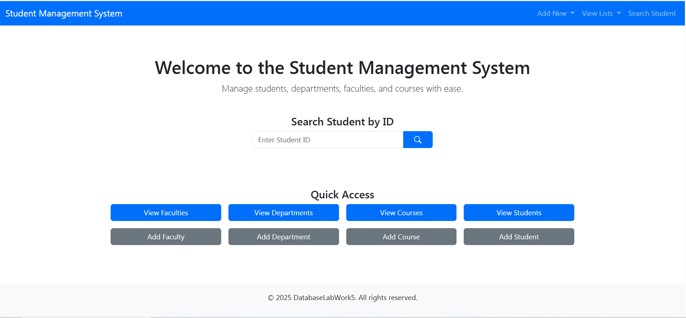

# ORM Architecture

Bu ödev kapsamında, Entity Framework, SQL Server ve C# kullanılarak Code First 
yaklaşımıyla bir öğrenci yönetim sistemi geliştirilmiştir. Web tabanlı olarak tasarlanan 
uygulama, öğrenci, bölüm, fakülte ve ders bilgilerini yönetmek için kullanıcı dostu bir 
arayüz sunar. Sistem, altı ana ekrandan oluşmakta olup, her biri farklı CRUD (Create, Read, 
Update, Delete) işlemlerini ve özel işlevleri destekler.

<p align="center"></p>

## İçindekiler
- [ORM Architecture](#orm-architecture)
  - [İçindekiler](#i̇çindekiler)
  - [Genel Bilgi](#genel-bilgi)
  - [Kurulum](#kurulum)
  - [Tablo Yapısı](#tablo-yapısı)
---
## Genel Bilgi
Bu proje, Entity Framework, SQL Server ve C# kullanılarak Code First yaklaşımıyla 
geliştirilen bir öğrenci yönetim sistemidir. Web tabanlı uygulama, öğrenci, bölüm, fakülte 
ve ders bilgilerini yönetmek için tasarlanmıştır. Sistem, öğrenci ve ders kayıtlarının 
tutulduğu, CRUD işlemlerinin gerçekleştirildiği ve özel raporlamaların yapıldığı altı ana 
ekrandan oluşur. Kullanıcı dostu bir arayüzle, öğrenciler için ders atama, not girişi ve 
yıl/yarıyıl bazlı filtreleme gibi işlevler sunulmaktadır. Bootstrap ile responsive bir tasarım 
sağlanmış, navigasyon butonları ve filtreleme özellikleri kullanıcı deneyimini artırmıştır. 
Proje, modern veritabanı yönetim tekniklerini ve nesne yönelimli programlamayı 
birleştirerek, eğitim kurumlarının ihtiyaçlarına yönelik etkili bir çözüm sunar. Bu rapor, 
sistemin geliştirme sürecini, kullanılan teknolojileri ve ekranların işlevselliğini detaylı bir 
şekilde açıklamaktadır. 

---
## Kurulum
**Gerekli Yazılımlar:**

- Microsoft SQL Server ve SQL Server Management Studio (SSMS) kurulu olmalıdır.

- Visual Studio 2022 veya daha yeni bir sürüm kurulu olmalıdır.

- .NET 6.0 veya daha yeni bir sürüm yüklü olmalıdır.

**Yeni Bir Proje Oluşturun:**

1. Visual Studio 2022'yi açın.

2. Yeni Proje Oluştur seçeneğine tıklayın.

3. ASP.NET Core Web App (Model-View-Controller) şablonunu seçin.

4. Proje adını ve konumunu belirledikten sonra Create butonuna tıklayın.

5. .NET 6.0 (Long-term support) sürümünü seçin ve Create butonuna tıklayın.

**Entity Framework Core ile Bağlantı:**

- NuGet Paket Yöneticisi üzerinden aşağıdaki paketleri kurun:

```
dotnet add package Microsoft.EntityFrameworkCore.SqlServer
dotnet add package Microsoft.EntityFrameworkCore.Tools
```
**Veritabanı Bağlantısı:**

- appsettings.json dosyasına, SQL Server veritabanınıza bağlantı dizesini ekleyin:

```json
"ConnectionStrings": {
  "DefaultConnection": "Server=localhost;Database=ProjeDB;Trusted_Connection=True;"
}
```
**Model Sınıflarını Oluşturun:**

- Models klasörü altında gerekli model sınıflarını oluşturun. Örnek:

```csharp
public class Product
{
    public int Id { get; set; }
    public string Name { get; set; }
    public decimal Price { get; set; }
}
```
**DbContext Sınıfını Oluşturun:**

- Data klasörü altında bir ApplicationDbContext sınıfı oluşturun:

```csharp
public class ApplicationDbContext : DbContext
{
    public ApplicationDbContext(DbContextOptions<ApplicationDbContext> options)
        : base(options)
    {
    }

    public DbSet<Product> Products { get; set; }
}
```

Bu koda proje içerisinde bulunan Data klasöründen erişebilirsiniz.

**Veritabanı Migrasyonlarını Yapın:**

- Package Manager Console üzerinden aşağıdaki komutları çalıştırarak veritabanını oluşturun:

```
Add-Migration InitialCreate
Update-Database
```


## Tablo Yapısı
Veritabanı şu temel tabloları içermektedir:

- **Courses Tablosu**
- **Faculties Tablosu**
- **Students Tablosu**
- **Departments Tablosu**
- **StudentCourses Tablosu**

Bu tablolara proje içerisinde bulunan Models klasöründen erişebilirsiniz.

---
Bu öğrenci yönetim sistemi projesi, Entity Framework Core, SQL Server ve C# kullanılarak ASP.NET Core MVC çerçevesinde başarıyla tamamlanmıştır. Code First 
yaklaşımıyla tasarlanan sistem, öğrenci, bölüm, fakülte ve ders bilgilerini yöneten altı ekran 
üzerinden kullanıcı dostu bir deneyim sunar. 

**TODO**
